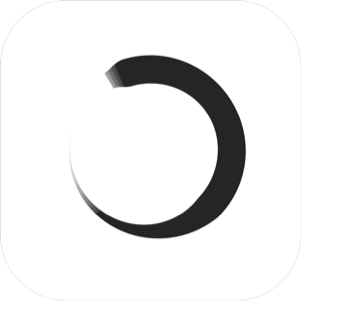
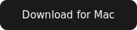
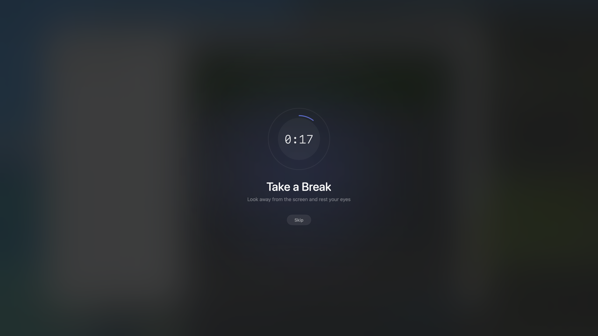
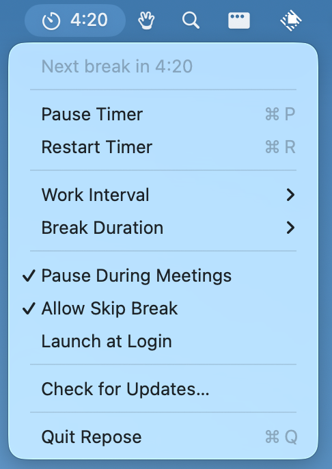

<div align="center">
  
  <h1>Repose</h1>
  <p><strong>Take breaks from your screen. Without interrupting your meetings.</strong></p>
  <a href="https://github.com/fikrikarim/repose/releases/latest/download/Repose.dmg">
    
  </a>
  <p><sub>Free and open source. Requires macOS 13+.</sub></p>
</div>

<br/>

<div align="center">
  
</div>

<br/>

Repose lives in your menu bar, counts down your work interval, and dims your screen when it's time to rest your eyes. When the break ends, the cycle starts again.

The difference from every other break reminder: **Repose detects when you're in a meeting and stays out of your way.** No calendar integration, no app-specific setup. If your camera or mic is active, it knows you're on a call and waits. If you keep your mic on all the time, you can tell Repose to ignore microphone activity and rely on the camera check instead.

## How it works

1. Set your work interval (5–60 min) and break duration (20 sec–5 min)
2. A countdown appears in your menu bar
3. When time's up, your screen dims with a gentle reminder to look away
4. If you're on a call, the timer pauses automatically until you're done
5. If you stop using your mouse and keyboard, the timer pauses quickly and only resets after a full natural break away from the computer

<div align="center">
  
</div>

Everything is in the menu — pause, resume, restart, all settings, including an option to ignore microphone activity for meeting detection and turn natural break detection on or off. No separate preferences window.

## Why the meeting detection actually works

Most break apps check your calendar or look for specific apps running. Both break easily — your calendar doesn't know about the impromptu call your manager just started, and "Zoom is open" doesn't mean you're in a meeting.

Repose checks the hardware directly. It uses CoreMediaIO to detect active cameras and CoreAudio for microphones. If something is using your camera or mic right now, you're probably in a call, so it backs off.

This means it works with Zoom, Meet, FaceTime, Teams, Slack huddles, and whatever you end up using next year. Zero configuration.

## Natural break detection

Repose also detects when you've stepped away from your computer. If there's no keyboard or mouse activity for 10 seconds, the timer pauses right away so you don't lose progress during a quick interruption.

If that inactivity lasts for your full work interval, Repose treats it as a natural break and resets to a fresh work cycle. Short interruptions just pause and resume where you left off.

It's smart about passive screen use too: if you're watching a video (where apps keep the display awake), the timer keeps running so you still get break reminders.

## Future ideas

- Potential future feature: Wellnomics-style micropause behavior. Wellnomics appears to mark the timer inactive after roughly 2-3 seconds, while Repose's main timer currently waits 10 seconds before going inactive.
- Wellnomics also describes a break hierarchy where Wellbeing Breaks have the highest priority, Sit-stand Changes come next, and Micro-pauses are lowest priority. If a higher-priority break is due before the next micro-pause, the micro-pause timer pauses and resumes only after that higher-priority break completes.
- Preserve this reference for future research on micropause behavior and how it interacts with the main timer: [Wellnomics micropause details](https://service.desk.wellnomics.com/servicedesk/customer/portal/3/topic/6bf32c8b-c0a3-4664-8cca-5beb63998a18/article/1978531895)

## Install

### Download

[Download the latest DMG](https://github.com/fikrikarim/repose/releases/latest/download/Repose.dmg), open it, and drag Repose to Applications.

Updates are handled automatically via Sparkle.

### Build from source

```
git clone https://github.com/fikrikarim/repose.git
cd repose
brew install xcodegen
xcodegen generate
open Repose.xcodeproj
```

Requires Xcode 15+ and macOS 13+.

## License

MIT
